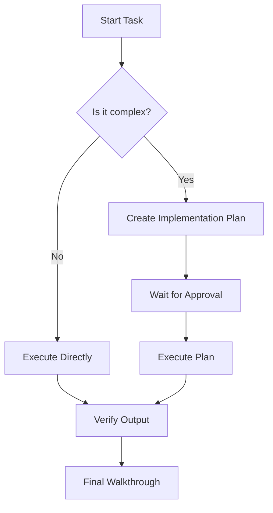

# PromptAgent Professional Preview Test Suite

This file tests the advanced rendering capabilities of the **PromptAgent Preview** extension, optimized for Prompt Engineering and Agent workflows.

## 1. Professional Callouts (Design System)

::: note
**Note Callout**
This is a standard information block. Use it for general context or background details that help the agent understand the task.
:::

::: tip
**Pro Tip**
Use this to suggest specific techniques or shortcuts that can improve the quality of the generated response.
:::

::: warning
**Warning**
Be careful with these parameters. Setting the temperature too high may result in hallucinated or inconsistent outputs.
:::

::: important
**Critical Instruction**
Always verify the output against the core requirements before finalizing the prompt. This step is mandatory.
:::

## 2. GitHub-Style Alerts (New)

> [!NOTE]
> Useful information that users should know, even when skimming content.

> [!TIP]
> Helpful advice for doing things better or more easily.

> [!IMPORTANT]
> Key information users need to know to achieve their goal.

> [!WARNING]
> Urgent info that needs immediate user attention to avoid problems.

> [!CAUTION]
> Negative potential consequences of an action.

## 3. Advanced Typography & Markdown

  - subscript: H~2~O, Superscript: X^2^.

## 4. Diagrams (Mermaid)



## 5. Mathematical Expressions (LaTeX)

- **Inline Math:** The energy equation is $E = mc^2$.
- **Block Math:**
$$
\frac{-b \pm \sqrt{b^2 - 4ac}}{2a}
$$

## 6. Tables (Data & Layout)

### 6.1. Feature Comparison (Aligned Columns)

| Extension Feature | Status | Alignment | Priority |
| :--- | :---: | ---: | :---: |
| **Bilingual Support** | ✅ | Left | High |
| **Mermaid Support** | ✅ | Center | Medium |
| **Table Rendering** | ✅ | Right | High |
| **LaTeX Support** | ✅ | Center | Low |

### 6.2. Wide Table (Responsive Scroll Test)

| ID | Project Name | Responsible Agent | Start Date | End Date | Status | Budget | Tech Stack | Notes |
| :--- | :--- | :--- | :--- | :--- | :--- | :--- | :--- | :--- |
| P-001 | **Quantum Prompting** | Agent Alpha | 2026-01-01 | 2026-03-31 | `ACTIVE` | $15,000 | Next.js, OpenAI | High priority research project. |
| P-002 | **Neural Vision** | Agent Beta | 2026-02-15 | 2026-05-20 | `PLANNING` | $8,500 | Python, PyTorch | Focus on Veo 3.1 optimization. |
| P-003 | **Glassmorphic UI** | Agent Gamma | 2026-04-10 | 2026-06-15 | `PENDING` | $12,000 | Tailwind, Vite | Premium design system extension. |
| P-004 | **Legacy Sync** | Agent Delta | 2025-11-20 | 2026-01-15 | `COMPLETED` | $5,000 | Node.js | Migration of older prompt structures. |

### 6.3. Rich Content in Cells

| Component | Example Content |
| :--- | :--- |
| **Bold & Italic** | **Strict** vs *Creative* |
| **Links** | [Go to Website](https://manhhuynh.work) |
| **Code** | `const x = 10;` |
| **Callouts** | Not supported inside cells |

## 7. Premium Prompt Blocks

```text
[Role]: You are an elite visual director.
[Task]: Generate a prompt for a cinematic product video.
[Style]: Dark, sleek, futuristic, glassmorphism.
```

```javascript
// Test copy functionality
function test() {
    console.log("Premium Code Wrapper!");
}
```

## 8. Visual Media & Images

- **Standard Image:**


- **Interactive Carousel:**
```carousel

### Slide 1: Abstract Geometry
Testing the carousel with a high-quality abstract image and a descriptive caption.

<!-- slide -->


### Slide 2: Cyberpunk Aesthetic
The carousel supports multiple slides with different content types, including images and markdown text.

<!-- slide -->

```javascript
// You can even put code blocks inside slides!
function helloCarousel() {
    console.log("I am a slide with code!");
}
```
### Slide 3: Code Content
Testing recursive rendering of code blocks within carousel slides.
```

## 9. Technical Artifact Identification

- `[INTERNAL_PROCESS]`: This text should be styled as secondary bracket text.
- `[TODO]`: Another example of metadata identification.

## 10. Footnote Definitions

[^1]: Chain-of-Thought (CoT) is a prompting technique that encourages the model to explain its reasoning process step-by-step.

---

**End of Test File.**
