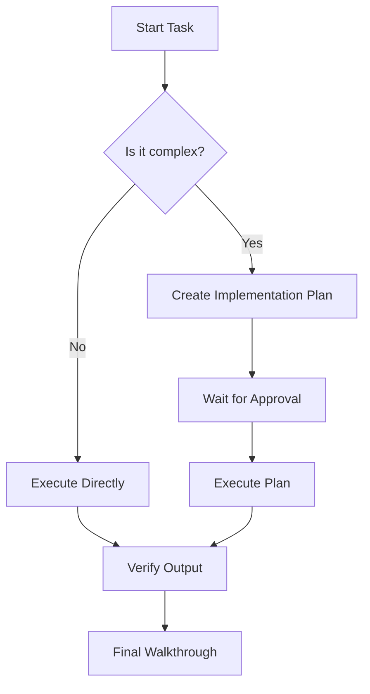

# PromptAgent Professional Preview Test Suite

This file tests the advanced rendering capabilities of the **PromptAgent Preview** extension, optimized for Prompt Engineering and Agent workflows.

## 1. Professional Callouts (Design System)

::: note
**Note Callout**
This is a standard information block. Use it for general context or background details that help the agent understand the task.
:::

::: tip
**Pro Tip**
Use this to suggest specific techniques or shortcuts that can improve the quality of the generated response.
:::

::: warning
**Warning**
Be careful with these parameters. Setting the temperature too high may result in hallucinated or inconsistent outputs.
:::

::: important
**Critical Instruction**
Always verify the output against the core requirements before finalizing the prompt. This step is mandatory.
:::

## 2. Advanced Typography & Markdown

  - subscript: H~2~O, Superscript: X^2^.

## 3. Diagrams (Mermaid)



## 4. Mathematical Expressions (LaTeX)

- **Inline Math:** The energy equation is $E = mc^2$.
- **Block Math:**
$$
\frac{-b \pm \sqrt{b^2 - 4ac}}{2a}
$$

## 4. Tables

| Feature | Status | Description |
| :--- | :---: | :--- |
| **Auto-Open** | ✅ | Opens preview alongside editor |
| **Live Sync** | ✅ | Hot-reloads content instantly |
| **Callouts** | ✅ | Professional design system colors |
| **Comments** | ✅ | Floating action button for feedback |

## 5. Premium Prompt Blocks

```text
[Role]: You are an elite visual director.
[Task]: Generate a prompt for a cinematic product video.
[Style]: Dark, sleek, futuristic, glassmorphism.
```

```javascript
// Test copy functionality
function test() {
    console.log("Premium Code Wrapper!");
}
```

## 6. Visual Media & Images

- **Standard Image:**


- **Interactive Carousel:**
```carousel

### Slide 1: Abstract Geometry
Testing the carousel with a high-quality abstract image and a descriptive caption.

<!-- slide -->


### Slide 2: Cyberpunk Aesthetic
The carousel supports multiple slides with different content types, including images and markdown text.

<!-- slide -->

```javascript
// You can even put code blocks inside slides!
function helloCarousel() {
    console.log("I am a slide with code!");
}
```
### Slide 3: Code Content
Testing recursive rendering of code blocks within carousel slides.
```

## 7. Technical Artifact Identification

- `[INTERNAL_PROCESS]`: This text should be styled as secondary bracket text.
- `[TODO]`: Another example of metadata identification.

## 8. Footnote Definitions

[^1]: Chain-of-Thought (CoT) is a prompting technique that encourages the model to explain its reasoning process step-by-step.

---

**End of Test File.**
